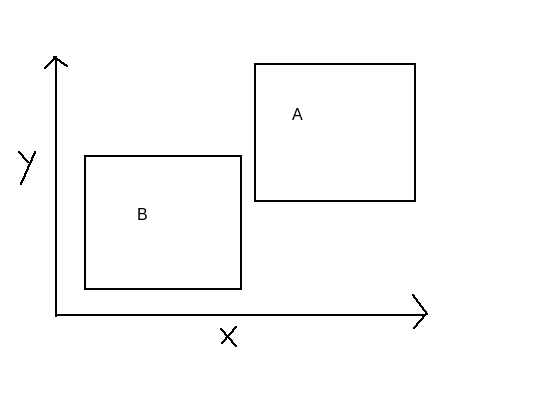

# ACM Collision

## AABB intro
If you've never worked on games before you may not have heard of `Axis Aligned Bounds Boxes` or `AABB` for short. These are squares represented by points on a graph like this:


Note that the bottom of the box is parallel to the x axis and the side to the y axis, this is the `Axis Aligned` part of `AABB`. Now let's imagine we have two such boxes like so: 


## Collision

How do know if they're touching? May seem simple enough right? we look at them and **see** them not touching, but how do we tell a function to **see** this? Well it's actually pretty simple, let's start by trying to prove if **they can never touch** this may seem counter intuitive, but stay with me. What if we see if the end of one box is before the start of the other box. For now we will stick to just the `x axis`. Let's take a look:


See the red points? Those are the x axis bounds for box A and the ending point (the right one) ends before the start (first blue point) of box B. Being that they never have a chance of touching since their x bounds never overlap we can represent this in an if statement as such:

```java 
if(maxA < minB)
```
Where maxA is ```boxA.getX() + boxA.getWidth()``` and minB is ```boxB.getX()```. No too bad so far right? Now let's think if we switch the order of the boxes so box B is actually in front of box A:



Our previous function won't catch this, but we can simply add one more check to our if statement to see if ```maxB``` is less than ```minA``` esentially checking what we did before but for reverse order:


```java 
if(maxA < minB || maxB < minA)
```

Wow! that's one compact if statment, the only thing missing to complete it is a ``` return ``` statement so let's add it:


```java 
if(maxA < minB || maxB < minA) return false;
```
Note that we ``` return false ``` because we are checking to see if they never touch, thus if the above is true we return false meaning **they can never touch** and thus **did not collide**. So we're done here right? Wrong. This check is great but what about this case:


Our function is right not to return false quite yet, but clearly they don't touch right? Well so far we only considered the `x axis` so now we will consider the `y-axis`. It's actually quite similar to the process above, just with different points:


We can use the same logic above to check if the boxes have a point where their y's overlap like so:

```java
if(maxYB > minYA)
```

where ```maxYB``` is ```boxB.getY() + boxB.getHeight()``` and ```minAB``` is ```boxA.getA()```. Again we are simply checking if box B ends before box A begins, which means they can never touch. And much like the above example we need to account for box A coming before box B:

```java
if(maxYA > minYB || maxYB > minYA) return false;
```

Another clean if statement, now what should happen if the function continues past these two if statements? Well that means **they have to touch** as they over lap on both the `x` and `y` axes. Let's pull it all together:

```java
if(maxA < minB || maxB < minA) return false;
if(maxYA > minYB || maxYB > minYA) return false;
return true;
```
It sure looks neat doesn't it? only three whole lines, but wait how does all this relate to the ACM library? Well all ```GObjects``` have a handy function built right in: ```getBounds()```. Using ```getBounds()``` we can compare any two ```GObjects```. When called ```getBounds()``` returns a ```GRectangle``` that encapsolates the ```GObject``` that called it. Knowing this, we can finally make a whole function:

```java
public boolean checkCollision(GRectangle boxA, GRectangle boxB){
if(maxA < minB || maxB < minA) return false;
if(maxYA > minYB || maxYB > minYA) return false;
return true;
}
```

## Static functions
Obviously this function is missing the declarations of ```maxA, minB, maxB, minA, maxYA, minYB, maxYB``` and ```minYA```, but hey they are explained above. The last question is **where** to put this function, should we put it in ```MainApplication```? or maybe a ```GraphicsPane```? Well maybe you have projectiles so surely some kind of ```Player``` class would need to check if they've been hit. While most of these may seem like good places, I have a better suggestion. Let's create a new class file called ```Utility.java``` and in this we can put our checkCollision function, but first let's make it static like so: 

```java
public static boolean checkCollision(GRectangle boxA, GRectangle boxB){
```
Now we can call it anywhere by simply putting something like:

```java
boolean collided = Utility.checkCollision(someObject.getBounds(), someOtherObject.getBounds()); 
```

How convenient is that? Now that collision is figured out the sky is the limit! now we could say check if a ball hit the player or if a ship's bullet hit an enemy. This function is very useful and you may even use it again in the not so distant future. On a final note you may find yourself reusing a function much like collision, and if you do maybe putting it into ```Utility.java``` and making it ```static``` makes a lot of sense, but that's not my problem. Good luck and just remember good games make things collide!


